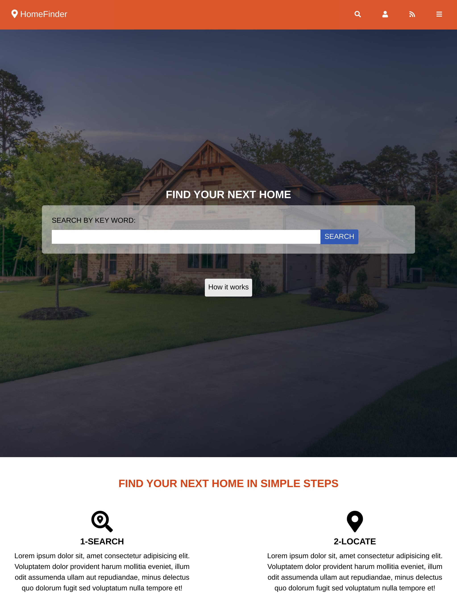
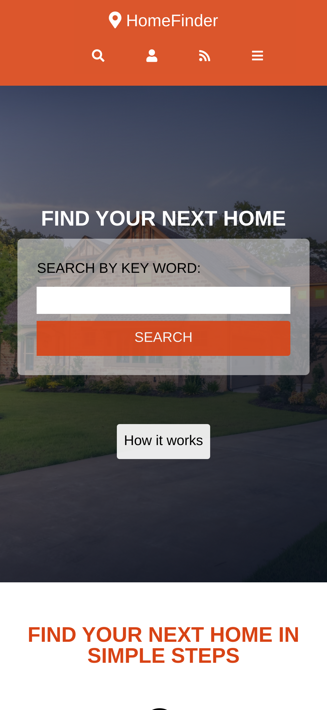

## CAPSTONE PROJECT:  HomeFinder

this is a simple that help people relocation to a new place find the best home that matches their needs. 
The purpose of this project is to demonstrate my understanding in HTML5 and CSS3 in solving real world problems. 
This project consist of index page which is the landing page for the site, the search results page which list all avaialable homes and a detail page which show detail information about a particular home
- The site is responsive and accomodate devices that fall in three breakpoints 
    * up-to 768px -small devices
    * up-to 1024px  -medium devices
    * from 1024px and above -large devices

# Large screen 


# medium screen 


# small screen 



## Built With

- HTML5
- CSS3


## Author

- Github: [@githubhandle](https://github.com/chirchir12 )
- Twitter: [@twitterhandle](https://twitter.com/shadochir )
- Linkedin: [linkedin](https://www.linkedin.com/in/emmanuel-chirchir/ )
- Email: [email](chirchir7370@gmail.com)


## Getting started

- Clone the repository with:
    ``` https://github.com/chirchir12/homeFinder.git  ```
- cd to ```homeFinder```

- See the original instructions [here](https://www.notion.so/HTML-CSS-capstone-project-Directory-of-Schools-eea352bfaf3e4a83b2917df1f9a4e140)

- Check the index.html to edit the structure of the page.

- Check the style.css to edit the style of the page.

## 🤝 Contributing

Contributions, issues and feature requests are welcome!

Feel free to check the [issues page](issues/).

## Show your support

Give a ⭐️ if you like this project!

## Live preview

You can check how the website looks [here](https://rawcdn.githack.com/chirchir12/homeFinder/4b877cd328babd0df79633fd8d4ac167ab334ce8/index.html)
## 📝 License

This project is [MIT](lic.url) licensed.
